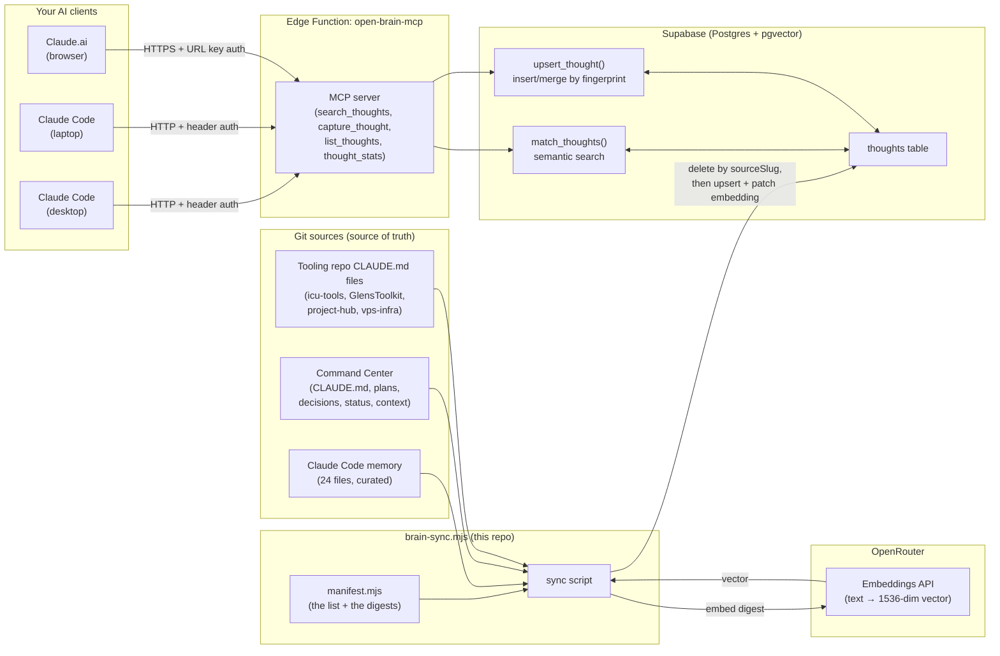
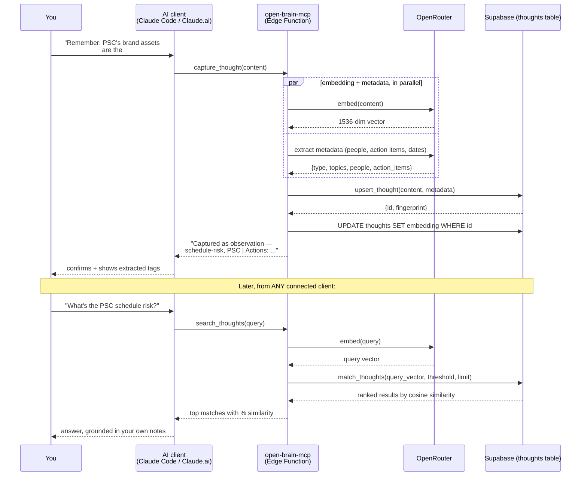
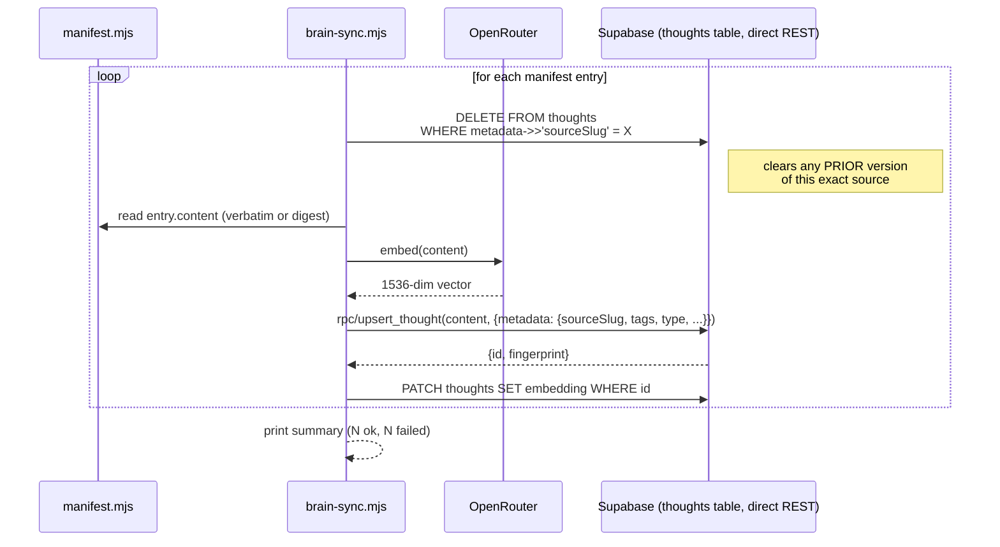
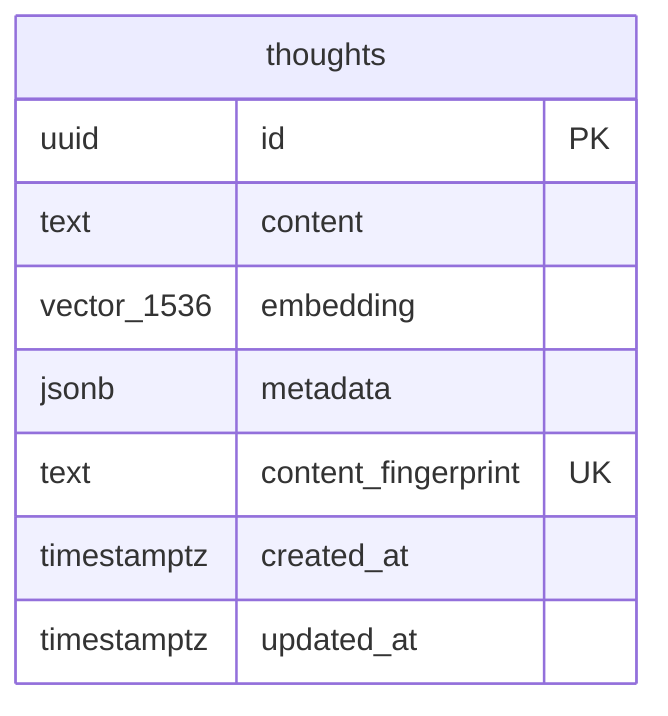
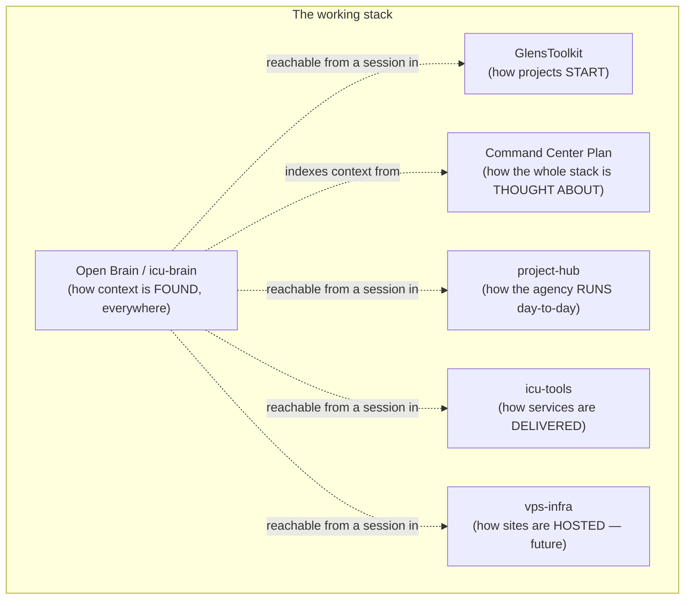

# Open Brain — Architecture

> How this system actually works, for future-Uriah reading this cold. No assumed knowledge of MCP, pgvector, or Edge Functions — each diagram has a plain-English walkthrough underneath it.

---

## 1. System overview

**The one-sentence version:** your planning docs live in git as they always have; a script reads them and stores a searchable copy in a small database; every AI client you use (Claude Code on two machines, Claude.ai in the browser) can query that same database through one shared connection.

**Walkthrough:** there are two completely separate write paths into the same `thoughts` table, and understanding that they're different is the single most important thing about this system:

1. **The sync path (left side, top)** — this is how *structured* content (everything you already write down anyway) gets in. `brain-sync.mjs` reads `manifest.mjs`, gets an embedding for each digest from OpenRouter, and writes directly to the Supabase database using the project's own secret key — it doesn't go through the MCP server at all.
2. **The live-capture path (right side)** — this is how *any AI client* saves a new thought in the moment, mid-conversation, via the `capture_thought` tool. It goes through the deployed `open-brain-mcp` Edge Function, which generates the embedding itself and extracts metadata automatically.

Both paths land in the same table, so both are searchable from anywhere — but only the live-capture path is what "any AI client" can trigger; the sync path is a script you (or a future Claude session) run deliberately.

---

## 2. Capture and retrieval — what happens on a live tool call

This is what runs when you ask any connected AI "remember this" or "what did I capture about X."

**Walkthrough:** capture and search are mirror images of each other. Capture turns text into a vector and metadata, then stores it. Search turns your *question* into a vector too, then asks Postgres "which stored vectors point in a similar direction to this one?" — that's what `match_thoughts` does with the `<=>` cosine-distance operator. Nothing about the words has to match; "what's the PSC schedule risk" and a stored thought about "brand assets are undelivered" can match because they mean similar things, not because they share vocabulary. (Golden-query test #10 in `docs/golden-queries.md` is a useful real example of where this *doesn't* work as well as hoped — very abstract queries with little vocabulary overlap can still miss.)

**The auth split, concretely:** Claude Code sends the access key as an HTTP header (`x-brain-key: ...`) because it's capable of custom headers on remote MCP connections. Claude.ai's web/desktop client cannot send custom headers to a remote MCP server, so the same key instead rides along in the connection URL itself (`...?key=...`), and the server is told "no additional auth" — the URL *is* the auth. One endpoint, two ways in, because the two clients have different capabilities.

---

## 3. Sync path — how migration and re-sync actually work

This is the path Step 4 of Plan 0013 exercises, and the one you'll re-run whenever a source doc changes.

**Walkthrough — why delete-then-reinsert instead of a normal update:** the database's own `upsert_thought` function dedupes by hashing the *content itself* (a "fingerprint"). That's great for catching a live AI client accidentally capturing the exact same thought twice. But it's the wrong tool for re-syncing an *edited* source — if you change even one word in `status.md`, the fingerprint changes completely, so the schema's own dedup would treat it as brand new and leave the old, now-wrong version sitting in the database forever as an orphan. The sync script sidesteps this by tagging every synced thought with a stable `sourceSlug` (e.g. `cc-status-current`) in its metadata, and always clearing anything with that slug immediately before writing the fresh version. That's the mechanism that makes "stays up to date" actually true.

**Why this bypasses the Edge Function entirely:** the deployed `capture_thought` tool only accepts free-text content — it has no way to receive a custom `sourceSlug` or `tags`, because its metadata is auto-extracted by an LLM call, not supplied by the caller. That's the right design for *casual* capture (low friction, no schema to learn) but the wrong one for *structured* migration (you need deterministic, stable tags to make safe re-sync possible). So the sync script talks to Supabase's REST API directly, using the project's own secret key, replicating the same two steps the Edge Function does internally (`upsert_thought` then a `PATCH` to set the embedding) but with full control over the metadata payload.

**Verification is built in, not separate:** `node scripts/brain-sync.mjs --verify` walks the actual `context/`, `decisions/`, `plans/`, and memory directories on disk and diffs them against every `path` listed in the manifest — any file that exists but isn't in the manifest gets flagged as `UNLISTED`, any manifest entry pointing at a file that no longer exists gets flagged `STALE`. This is what makes "was anything missed" a checkable fact instead of a feeling; it caught one genuinely missed file (`project_psc_ticketing_stack.md`) the first time it ran.

---

## 4. Data model

**The `thoughts` table, in plain terms:**

| Column | What it holds |
| --- | --- |
| `id` | A random unique ID, generated automatically. |
| `content` | The actual text — either a live-captured thought, or a synced digest of a source doc. |
| `embedding` | The 1536-number vector that makes semantic search possible. Generated by OpenRouter, never written by hand. |
| `metadata` | A flexible JSON bag. Live captures get `{type, topics, people, action_items, source: "mcp"}` (auto-extracted). Synced entries get `{sourceSlug, sourceFile, type, tags, source: "brain-sync", syncedAt}` (explicit, from the manifest). |
| `content_fingerprint` | A hash of the exact content text, used by the database's own dedup logic (`upsert_thought`) to avoid two identical live captures becoming two rows. Synced entries also get one, but the sync script's own `sourceSlug`-based delete is the mechanism that actually matters for *them* — the fingerprint is secondary. |
| `created_at` / `updated_at` | Standard timestamps; `updated_at` auto-refreshes via a trigger whenever a row changes. |

**Indexes that make it fast:** an HNSW index on `embedding` (the thing that makes semantic search sub-second instead of scanning every row), a GIN index on `metadata` (fast filtering by type/topic/person), a plain index on `created_at` (fast "recent thoughts" queries), and a unique index on `content_fingerprint` (the dedup enforcement).

**The two SQL functions:**
- **`match_thoughts(query_embedding, threshold, count, filter)`** — the search engine. Ranks every row by cosine similarity to the query vector, keeps only rows above the similarity threshold, optionally filters by metadata containment, returns the top N.
- **`upsert_thought(content, payload)`** — the write path both the Edge Function and the sync script use. Computes the content fingerprint, inserts a new row or merges metadata into an existing one if the *exact same content* already exists, returns the row's ID so the caller can immediately patch in the embedding as a follow-up step (embeddings aren't computed inside the database — they come from OpenRouter, so they're always set in a second step after the row exists).

---

## 5. Where this fits in Uriah's wider stack

Open Brain doesn't replace any of the other layers — it's the one layer that's reachable from *inside* every other layer, and from the browser too. A Claude Code session opened in `project-hub` can search the same brain as one opened in `icu-tools` or in Command Center itself, because the MCP connection is registered at *user* scope, not per-project.
